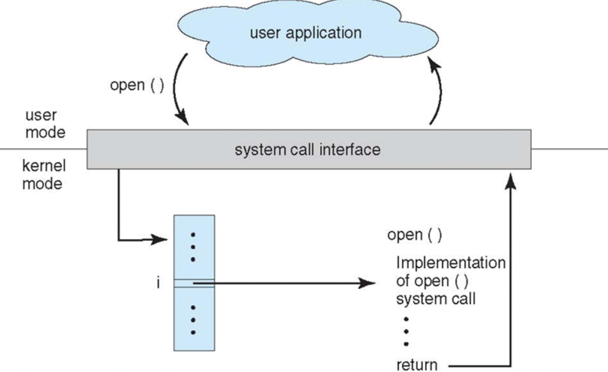

# 操作系统概述

## 基本特征

  1. 并发

     通过进程和线程使得程序可以并发执行

  2. 共享

     共享指的是多进程可以共享同一资源

     1. 互斥共享

        互斥共享的资源称为临界资源，同一时刻只能被一个进程所访问，需要同步机制来实现互斥访问

     2. 同时共享

  3. 虚拟

     虚拟技术指的是把一个物理实体转化为多个逻辑实体

     1. 时分复用技术

        比如多个进程在同一个处理器上执行任务，

     2. 空分复用技术

        虚拟内存使用了空分复用技术，它将物理内存抽象为地址空间，每个进程都有各自的地址空间，地址空间的页被映射到物理内存。

        地址空间的页并不需要全部映射到物理内存中，当使用到一个没有在物理内存中的页的时候，执行页面置换算法，将该页置换到内存中

  4. 异步

     异步指的是进程不是一次性执行完毕，而是走走停停，以不可知的速度向前

## 基本功能

  1. 进程管理

     进程控制，进程同步，进程通信，死锁处理，处理机调度等

  2. 内存管理

     内存分配，地址映射，内存保护与共享，虚拟内存等

  3. 文件管理

     文件存储空间的管理，目录管理，文件读写管理和保护

  4. 设备管理

     完成用户的I/O请求，方便用户使用各种设备，并提高设备的利用率。

     主要包括缓冲管理，设备分配，设备处理，虚拟设备

## 系统调用

  如果一个进程在用户态（user mode）需要使用到内核态（kernal mode）的功能，就进行系统调用陷入内核，由操作系统代为完成

## 宏内核和微内核

  1. 宏内核

     宏内核是将操作系统作为一个紧密结合的整体放到内核中，由于各模块共享资源，所以拥有很高的性能

  2. 微内核

     由于操作系统不断复杂，所以将操作系统的一部分功能移出内核，从而降低内核的复杂度，移出的部分根据分层的原则划分为若干服务，相互独立。

     在微内核结构下，只有微内核这一个模块处于内核态，其他模块运行在用户态，需要来回切换，所以具有一定的性能损耗

## 中断分类

1. 外中断

   由CPU执行指令以外的事件引起的，如I/O完成中断，表示设备I/O处理已完成，处理器能够发送下一个I/O请求，此外还有时钟中断，控制台中断等等

2. 异常

   由CPU执行指令的内部事件引起，如非法操作码，地址越界，算术溢出等

3. 陷入

   在用户程序中使用系统调用
