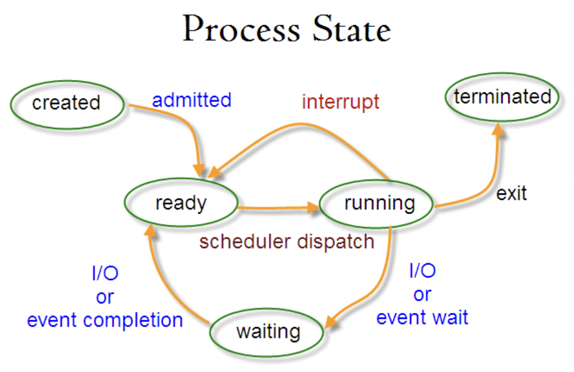
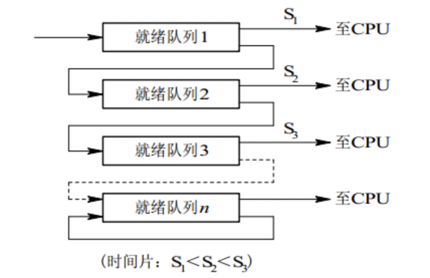
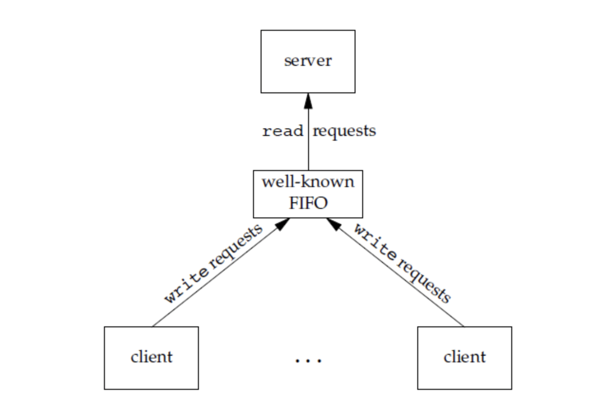

# 操作系统进程管理

## 进程与线程

1. 进程

   进程是资源分配的基本单位。

   进程控制块（Process Control Block，PCB）描述进程的基本信息和运行状态，所谓的创建进程和撤销进程，都是对PCB的操作。

2. 线程

   线程是独立调度的基本单位。

   一个进程中可以有多个线程，它们共享进程资源。

### 两者区别

1. 拥有资源

   进程是资源分配的基本单位，但线程不拥有资源，线程可以访问其隶属进程的资源。

2. 调度

   线程是独立调度的基本单位，在同一进程中，线程的切换不会引起进程的切换，从一个进程中的线程切换到另一个P中的T，会引起进程的切换。

3. 系统开销

   创建和撤销进程时系统都要为其分配资源或者回收资源，所付出的开销要远远大于create和withdraw线程的开销。

   相对应的，在进行进程切换时，设计当前执行的CPU环境的保存以及新调用的P的环境的配置，而线程只需要设置少量的寄存器内容。

4. 通信方面

   Thread之间可以通过读取Process中的同一资源进行通信，但是进程之间进行通信需要用到IPC。

## 进程状态的切换

- 就绪状态ready state：等待被调度
- 运行状态running state
- 阻塞状态waiting state：等待资源

只有ready和running可以相互转换（ready->running：Process通过进程调度算法获得运行时间；running->ready：该时间用完后就转变成了ready），其他的都只能单向转换

waiting状态是running状态的缺少需要的资源的时候转变的，但该资源不包括上述时间，上述时间用完后就变成了ready状态。

## 进程调度算法

不同环境的调度算法目标不同，因此需要分情况讨论。

### 1. 批处理系统

批处理系统没有太多的用户操作，在该系统中，调度算法的目标是保证吞吐量和周转时间（提交到终止的时间）

#### 1.1 先来先服务（First-come first-served, FCFS）

按照请求的先后顺序进行调度
如果前有长作业，后有短作业，可能造成短作业等待时间过长

#### 1.2 短作业优先（Shortest job first, SJF）

按估计运行时间最短的顺序进行调度
如果一直有短作业到来，那么长作业一直得不到执行

#### 1.3 最短剩余时间优先（Shortest remaining time next, SRTN）

如果当前来了一个作业，那么当前进程的剩余时间和这个作业的时间进行比较，哪个短运行哪个

### 2. 交互式系统

交互式系统中有大量的用户交互操作，在该系统中调度算法的目的是快速地进行响应。

#### 2.1 时间片轮转

将所有ready状态的进程按照FCFS的原则排成一个queue，每次调度时，从队首取出一个进程，为其分配CPU时间片，该时间片运行完后，由计时器发出时钟中断，调度程序就终止其运行，并将其送往ready队列的队尾（之前提到的ready和running的相互转换），同时将CPU时间片分给队首的进程。

- 如果时间片太小，那就会在保存设置环境上花很多时间。
- 如果时间片太长，那就不能保证实时性。

#### 2.2 优先级调度

为每个进程分配一个优先级，按照优先级进行调度。为了防止低优先级的永远得不到调度，可以随时间推移增加其优先级。

#### 2.3 多级反馈队列

一个进程如果需要100个时间片，那么采用2.1，就会交换100次。

为了解决上述问题，如下图，队列1没执行完的就放到队列2，最上面的优先级最高，最下面的时间片最长。
2.3可以看作是2.1和2.2的结合

### 3. 实时系统

实时系统要求一个请求在一个确定时间内得到响应。
分为硬实时和软实时，前者有个绝对的截止时间，后者可以忍受超时

## 进程同步

### 1. 临界区

对临界资源进行访问的那段代码称为临界区。

为了互斥访问临界资源，每个进程在进入临界区之前，需要先进行检查。

### 2. 同步与互斥

- 同步：多个进程因为合作产生的直接制约的关系，使得进程有着一定的先后执行的关系。
- 互斥：多个进程在同一时刻只有一个进程能进入临界区。

### 3. 信号量

信号量（Semaphore）是一个整形变量，可以对其执行down和up操作，也就是P和V操作。

- down：如果Semaphore大于0，执行-1操作，如果Semaphore等于0，进程睡眠，等待Semaphore大于0。
- up：对信号量执行+1操作，唤醒睡眠的进程让其执行down操作

如果信号量的取值只能为0和1，那么就成为了互斥量（Mutex），0表示临界区已经加锁，1表示解锁

### 4. 管程

使用信号量实现的生产者消费者问题需要客户端做很多的控制，而管程把控制的代码独立出来，不仅不容易出错，也使得客户端调用更加容易。

管程有一个重要特性：在同一时刻只能有一个进程使用管程。进程在无法执行时不能一直占用着管程，否则其它进程将永远调用不到。

管程引入了条件变量以及相关操作：wait()和signal()来实现同步操作，对条件变量执行wait()会导致调用进程阻塞，把管程让出来给另一个进程持有。signal()用于唤醒被阻塞的线程。

## 进程通信

进程同步和进程通讯很容易混淆，其区别在于：

- 进程同步：控制多个进程按照一定顺序执行；
- 进程通讯：进程之间传递信息。

进程通信是一种手段，进程同步是一个目的。也可以说，为了达到进程同步的目的，需要进程之间进行通讯，传递一些进程同步所需要的信息。

### 1. 管道

管道是通过调用pipe函数创建的，fd[0] 用于读，fd[1] 用于写。
它所具有的特质：

- 只支持半双工通讯（单向交替传输）
- 只能在父子进程或者兄弟进程中使用。

### 2. FIFO

也称为命名管道，去除了管道只能在父子进程中使用的限制。

FIFO常用于客户-服务器应用程序中，FIFO作为汇聚点，在客户进程和服务器进程之间传递数据。

### 3. 消息队列

相比于FIFO，消息队列具有以下优点：

- 消息队列可以独立于读写进程存在，从而避免了FIFO中同步管道的打开和关闭时所可能造成的困难；
- 避免了FIFO的同步阻塞问题，不需要进程自己提供同步方法；
- 读进程可以根据消息类型有选择地接收消息，而不是像FIFO那样只能默认接受。

### 4. 信号量

它是一个计数器，用于为多个进程提供对共享数据对象的访问。

### 5. 共享存储

允许多个进程共享一个给定的存储区。因为数据不需要在进程之间复制，所以这是最快的一种IPC。
需要使用信号量用来同步对共享存储的访问。
多个进程可以将同一个文件映射到他们的地址空间从而实现共享内存。另外XSI共享内存不是共享文件，而是共享内存的匿名段。

### 6. 套接字

与其他通信机制不同的是，它可以用于不同机器间的进程通讯。
